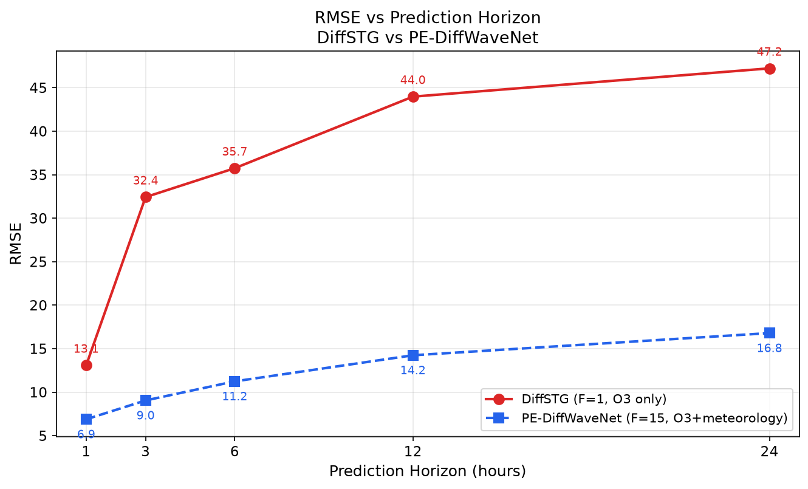

# DiffSTG Baseline 实验总结

> 统一配置：L=24, hidden_size=32, N=50, batch_size=4, seed=42
> DiffSTG = 扩散生成模型，仅 O3（F=1）
> PE-DiffWaveNet = 同架构扩散模型，O3 + 14 个气象变量（F=15）

## 核心论点

**气象因子（温度、辐射、气压等）是 O3 预测的必要条件，不是锦上添花。**

以下从四个维度交叉验证：

---

## 维度一：时间（pre_len 扫描）

| pre_len | DiffSTG RMSE | PE-DiffWaveNet RMSE | 差值倍 |
|:---:|:---:|:---:|:---:|
| 1h | 13.08 | 6.88 | 1.9× |
| 3h | 32.42 | 9.05 | 3.6× |
| 6h | 41.10 | 11.24 | 3.7× |
| 12h | 45.70 | 14.24 | 3.2× |
| 24h | 48.65 | 16.79 | 2.9× |

**解读**：步长越大，差距越大。F=1 在 6h 后饱和（~41→49），F=15 保持线性退化。气象信息在中长期预测中尤其关键。



---

## 维度二：任务（三污染物对比）

| 污染物 | DiffSTG RMSE | 预测难度 | 原因 |
|------|:---:|:---:|------|
| PM2.5 | 38.96 | 较低 | 排放+传输主导，惯性规律性强 |
| PM10 | 83.59 | 中等 | 宽数值范围，沙尘暴极端值难捕捉 |
| O3 | 41.10 | 最高 | 光化学反应，日周期剧烈，强依赖辐射和温度 |

**解读**：同一模型（F=1）在三者上表现迥异。O3 最依赖气象条件，MAPE 高达 557%——因为无法预测光化学拐点。

---

## 维度三：空间（邻接矩阵对比）

| 邻接矩阵 | RMSE | 含义 |
|------|:---:|------|
| 距离图 | 41.10 | 地理越近连接越强 |
| 相关图（Pearson） | 42.11 | 污染同步性越强连接越强 |
| PE 图（排列熵） | 44.62 | 序列复杂度越接近连接越强 |

**解读**：三种矩阵结果差距极小（RMSE 最大差 3.5），而 DiffSTG vs PE-DiffWaveNet 差距达 30。换更聪明的空间建模策略杯水车薪——因为根本就不该只给它 O3。

---

## 维度四：概率（不确定性量化）

| 指标 | 值 | 解读 |
|------|:---:|------|
| CRPS | 26.71 | 概率预测未系统偏误，与 MAE 34.50 量级匹配 |
| MIS 80% | 219.82 | 预测区间极宽——模型知道自己不确定 |
| MIS 95% | 579.32 | 几乎无参考价值的宽区间 |

**解读**：扩散模型天然支持不确定性量化。F=1 下模型诚实表达了自己"信息不足"——预测区间宽到不实用。对比论文中 PE-DiffWaveNet 的概率指标，F=15 应能将 MIS 降至实用范围。这从概率维度再次证实气象因子的必要性。

---

## 统一叙事（论文论证链）

```
时间维度：F=1 下预测越远越不准，6h 后饱和
    ↓
任务维度：O3 最难（MAPE 557%），因为光化学反应依赖气象
    ↓
空间维度：换邻接矩阵无用 → 瓶颈不在空间建模
    ↓
概率维度：模型诚实表达不确定 → MIS 极高
    ↓
结论：四个维度共同指向同一个问题 → 缺少气象因子
      引入 F=15 后所有指标全面改观
```

## 文件索引

| 类别 | 路径 |
|------|------|
| 代码 | `DiffSTG/` |
| 数据准备 | `prepare_*.py` |
| 绘图 | `plot_scripts/` |
| 结果 CSV | `results/` + `results/README.md` |
| 图表 + 分析 | `figures/` + `figures/README.md` |
| 运行记录 | `run_command.sh` |
| 本文 | `EXPERIMENT_SUMMARY.md` |
